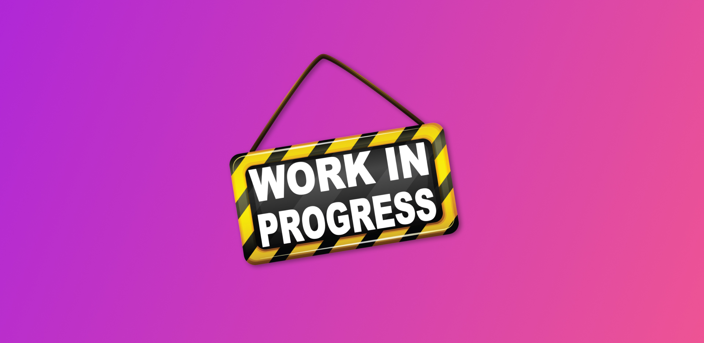

# NutriPlan-Asp.Net
Aplicacion web que le permite al usuario realizar una planificacion semanal de sus comidas, ya sea de manera aleatoria o manual.

# TODO LIST PRO 🔥


 &nbsp;
 &nbsp;
[]() &nbsp;




>Esta app hecha con React fue uno de mis primeros proyectos, es una imitación de la interfaz de usuario (UI) de hangouts.

&nbsp;

## Pre-requisitos 💻 

Antes de comenzar, verifica que cumplas con los siguiente:

* Estar utilizando Windows como sistema operativo.
* Tener instalado NodeJS
* Tener instalado Git.


&nbsp;

## Instalando 🔧

Abre tu consola en la ubicación donde quieras clonar el repositorio:

```bash
# Clona el repositorio
$ git clone https://github.com/francodder/todo-list-pro

# Entra a la carpeta del repositorio
$ cd todo-list-pro

# Instala todas las dependencias
$ npm install
```

&nbsp;


## ☕ Usando Hangouts clone

Usando NPM:

```bash
# Ejecuta la aplicación
$ npm run start
```

Listo! La una nueva pestaña se abrirá en tu navegador preestablecido, la aplicación estará corriendo en la url http://localhost:3000, ahora puedes crear listas, tareas, marcarlas y muchas cosas más.


<br>
